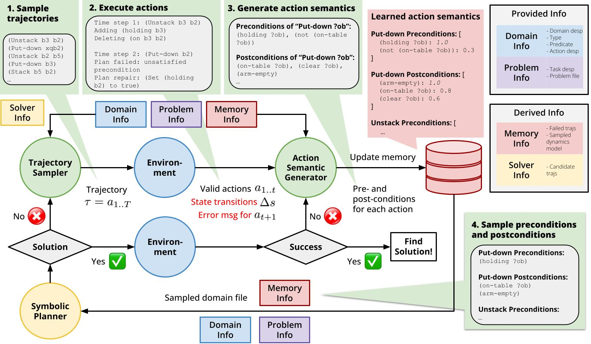

# Language Models can Infer Action Semantics for Classical Planners from Environment Feedback
This repo contains the source code for NAACL 2025 paper [Language Models can Infer Action Semantics for Classical Planners from Environment Feedback](https://arxiv.org/abs/2406.02791)

<p align="center">
  
</p>

## Dependency
1. Install OpenAI GPT [API](https://platform.openai.com/docs/quickstart/build-your-application). Remember to put openai_keys under the ```keys``` folder.

2. Install [fast-downward](https://drive.google.com/file/d/16HlP14IN06asIXYAZ8RHR1P7-cEYwhA6/view). For more details on fast-downward, please check the official [github repo](https://github.com/aibasel/downward) and the fast-downward [website](https://www.fast-downward.org/).

## Running Code
To run a for a specific task in a specific domain using a specific method:
```
python run_env.py --domain {YOUR_DOMAIN} --sample_traj_method {YOUR_TS} --infer_cnf_method {YOUR_ASG}
```
Alternatively, you can just use:
```
bash run.sh
```

## The File Hierarchy:
```
psalm
 └─run_env.py                         (the main python script)
 └─run.sh                         (the main experiment script)
 └─keys
    └─ openai_keys.txt             (you should place your openai keys here, one line each)
 └─domains                         (the generated domain files)
    └─ barman
        └─ description_geneator.py (generating natural language description)
        └─ p_example.nl            (example natural language)
        └─ p_example.pddl          (example problem pddl file)
        └─ p_example.sol           (example problem solution file)
        └─ p_example.sol_pddl      (example problem solution file in pddl)
        └─ domain.pddl             (the shared domain.pddl file for all problems)
        └─ xxx.nl                  (task natural language description)
        └─ xxx.pddl                (ground-truth problem pddl, might not be used)
    └─ blocksworld
    └─ floortile
    └─ grippers
    └─ storage
    └─ termes
    └─ tyreworld
 └─prompt                          (the prompt files)
    └─ xxx.txt
    └─ ...
 └─downwards                       (the directory for fast-downward C++ code and build)
    └─ ...
 └─experiments                     (the experiment files)
    └─ ...
 ```

## Citations
Please cite [this paper](https://arxiv.org/abs/2304.11477) if you find this repo useful.
```
@article{zhu2024languagemodelsinferaction,
      title={Language Models can Infer Action Semantics for Symbolic Planners from Environment Feedback}, 
      author={Wang Zhu and Ishika Singh and Robin Jia and Jesse Thomason},
      booktitle={Proceedings of the 2025 Conference of the North American Chapter of the Association for Computational Linguistics: Human Language Technologies (Volume 1: Long Papers)}
      year={2024}
}
```

## Acknowledgements
This repository is built upon the structure of [llm_pddl](https://github.com/Cranial-XIX/llm-pddl).